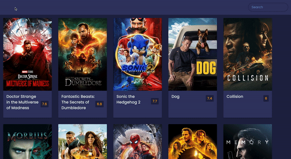
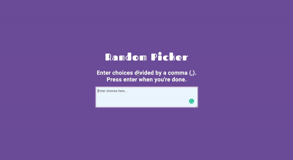

<h1 align="center"> Hi there 👋 I'm Maianne Thornton 
  Pronunciation: MY-an THORN-tuhn | Pronouns: (she/her) </h1>
I am skilled in HTML, CSS, Bootstrap, JavaScript, Chrome Dev Tools, React, Git, Terminal, NodeJS, Axios, Express and MongoDB.

I am passionate about creating technology experiences across all avenues of engagement with the goal of promoting equity through the user experience.

## Recent Projects

<table bordercolor="#d8c0d7">

<tr>
  <td width="50%" valign="top">
    <h3 align="center">Movie App</h3>
     
    

    
    
<strong>Javascript, Asynchronous API, CSS, HTML</strong> - A full-stack movie app that accesses a third-party API to display movie information. This app allows users to search for movies as well.

    </td>

  <td width="50%" valign="top">
    <h3 align="center">Random Picker</h3>
     
    

    
    
<strong>Javascript, CSS, HTML</strong> - A responsive front-end development site that produces an animated choice at random. Great for decision making!

    </td>
   </tr> 

  <tr>
  <td width="50%" valign="top">
    <h3 align="center">Earth Wind and Flour Restaurant Menu</h3>
     
    

    
    
<strong>React, Javascript, CSS, HTML</strong> - A restaurant menu created using React, HTML, CSS and JavaScript. This project allows users to filter meals by type.

    </td>

  <td width="50%" valign="top">
    <h3 align="center">The Book Nook</h3>
     
    

    
    
<strong>Javascript, Axios, CSS, HTML</strong> - A full-stack group project. Asynchronous API calls retrieve JSON data through REST API's to display book titles by subject.

    </td>
   </tr> 
</table>

## 🔭 I’m currently working on:

- Brad Traversy's 50 Projects in 50 Days
- FreeCodeCamp's Front End Development Libraries Course

## 🌱 I’m currently open to <em>remote and freelance opportunities</em>

## 👯 I’m looking to collaborate on:

- Any projects that will help me sharpen my coding skills
- Reach out with any project ideas we can use to build our portfolios!

## 📫 How to reach me:

- [LinkedIn](https://www.linkedin.com/in/MaianneThornton/)
- [Email](mailto:Maianne.Thornton@gmail.com)
- [Portfolio](https://maiannethornton-portfolio.netlify.app/)

<!--
**MaianneThornton/MaianneThornton** is a ✨ _special_ ✨ repository because its `README.md` (this file) appears on your GitHub profile.

Here are some ideas to get you started:

- 🔭 I’m currently working on ...
- 🌱 I’m currently learning ...
- 👯 I’m looking to collaborate on ...
- 🤔 I’m looking for help with ...
- 💬 Ask me about ...
- 📫 How to reach me: ...
- 😄 Pronouns: ...
- ⚡ Fun fact: ...
-->
