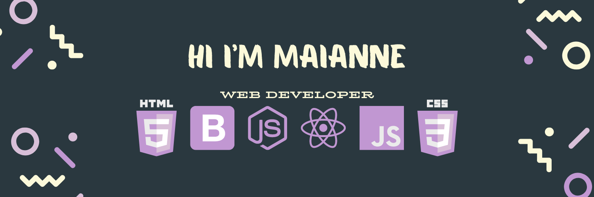

<h1 align="center"> Hi there 👋 I'm Maianne Thornton 
  Pronunciation: MY-an THORN-tuhn | Pronouns: (she/her) </h1>
I am skilled in HTML, CSS, Bootstrap, JavaScript, Chrome Dev Tools, React, Git, Terminal, NodeJS, Axios, Express and MongoDB. 

I am passionate about creating technology experiences across all avenues of engagement with the goal of promoting equity through the user experience.

## 🔭 I’m currently working on:

  - Brad Traversy's 50 Projects in 50 Days
  - FreeCodeCamp's Front End Development Libraries Course

## 🌱 I’m currently open to <em>remote and freelance opportunities</em>

## 👯 I’m looking to collaborate on:

  - Any projects that will help me sharpen my coding skills
  - Reach out with any project ideas we can use to build our portfolios!

## 📫 How to reach me:

  - [LinkedIn](https://www.linkedin.com/in/MaianneThornton/)
  - [Email](mailto:Maianne.Thornton@gmail.com)
  - [Portfolio](https://maiannethornton-portfolio.netlify.app/)

<!--
**MaianneThornton/MaianneThornton** is a ✨ _special_ ✨ repository because its `README.md` (this file) appears on your GitHub profile.

Here are some ideas to get you started:

- 🔭 I’m currently working on ...
- 🌱 I’m currently learning ...
- 👯 I’m looking to collaborate on ...
- 🤔 I’m looking for help with ...
- 💬 Ask me about ...
- 📫 How to reach me: ...
- 😄 Pronouns: ...
- ⚡ Fun fact: ...
-->
